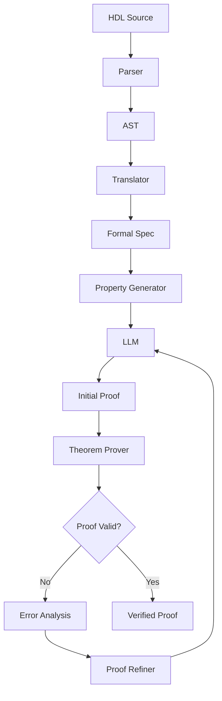

# Architecture Overview

This document describes the high-level architecture of formal-circuits-gpt.

## System Components

### 1. HDL Parsers (`parsers/`)

Responsible for parsing Verilog and VHDL source code into abstract syntax trees.

**Key Components:**
- `VerilogParser`: SystemVerilog/Verilog parser
- `VHDLParser`: VHDL parser  
- `AST`: Common AST representation

**External Dependencies:**
- PyVerilog for Verilog parsing
- VHDL-Tool for VHDL parsing

### 2. Formal Translators (`translators/`)

Convert HDL AST to formal specification languages.

**Key Components:**
- `IsabelleTranslator`: Generate Isabelle/HOL code
- `CoqTranslator`: Generate Coq specifications
- `PropertyGenerator`: Infer circuit properties

**Output Formats:**
- Isabelle theory files (.thy)
- Coq vernacular files (.v)
- Property specifications

### 3. LLM Integration (`llm/`)

Interfaces with Large Language Models for proof generation and refinement.

**Key Components:**
- `ProofGenerator`: Generate initial proofs
- `ProofRefiner`: Fix failed proofs
- `PromptManager`: Manage proof prompts
- `ResponseParser`: Parse LLM responses

**Supported Models:**
- OpenAI GPT-4/GPT-3.5
- Anthropic Claude
- Local models via API

### 4. Theorem Provers (`provers/`)

Interfaces with external theorem provers.

**Key Components:**
- `IsabelleInterface`: Isabelle/HOL integration
- `CoqInterface`: Coq integration
- `ProverResult`: Standardized results
- `ErrorAnalyzer`: Analyze proof failures

**Communication:**
- Process spawning for prover interaction
- Standard input/output parsing
- Timeout and resource management

### 5. Property System (`properties/`)

Manages correctness properties and specifications.

**Key Components:**
- `PropertySpec`: Property specification DSL
- `CommonProperties`: Built-in property templates
- `PropertyValidator`: Validate property syntax
- `PropertyInference`: Auto-generate properties

**Property Types:**
- Safety properties (invariants)
- Liveness properties (eventually)
- Temporal logic specifications

### 6. Search Engine (`search/`)

Implements deductive search and proof strategies.

**Key Components:**
- `ProofSearch`: Main search algorithm
- `SearchStrategy`: Various search strategies
- `LemmaCache`: Reusable lemma storage
- `GoalDecomposition`: Break down complex goals

**Search Strategies:**
- Breadth-first search
- Best-first search  
- Iterative deepening
- Monte Carlo tree search

## Data Flow

## Key Design Principles

### 1. Modularity
Each component is independent and replaceable:
- Parsers can be swapped for different HDL dialects
- Multiple theorem provers supported
- LLM backends are configurable

### 2. Extensibility
New components can be added easily:
- Plugin architecture for parsers
- Strategy pattern for search algorithms
- Template system for properties

### 3. Robustness  
System handles failures gracefully:
- Timeout mechanisms for all external calls
- Graceful degradation when provers fail
- Comprehensive error reporting

### 4. Performance
Optimized for large circuits:
- Incremental verification
- Parallel proof checking
- Lemma caching and reuse

## Configuration System

Central configuration manages:
- LLM API keys and endpoints
- Theorem prover paths
- Search parameters
- Logging levels

Configuration sources (priority order):
1. Command line arguments
2. Environment variables
3. Configuration file (~/.formal-circuits-gpt/config.yaml)
4. Defaults

## Error Handling

Structured error handling with specific exception types:
- `ParsingError`: HDL syntax issues
- `TranslationError`: AST to formal spec issues  
- `ProofFailure`: Theorem prover failures
- `LLMError`: LLM API issues

Each error includes:
- Detailed error message
- Context information
- Suggested fixes where possible

## Security Considerations

- API key management through environment variables
- Input validation for all HDL sources
- Sandboxed theorem prover execution
- No arbitrary code execution from LLM responses

## Future Extensions

Planned architectural improvements:
- Distributed proof checking
- Web-based verification interface
- Integration with EDA tools
- Support for SystemC/Chisel
- Advanced property synthesis