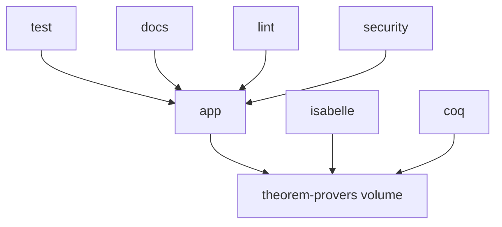

# Docker Deployment Guide

## Overview

Formal-Circuits-GPT provides comprehensive Docker support for development, testing, and production deployments. This guide covers all aspects of containerized deployment.

## Quick Start

### Development Environment
```bash
# Start development environment
docker-compose up app

# Run tests
docker-compose up test

# Run linting and type checking
docker-compose up lint

# Run security checks
docker-compose up security

# Serve documentation
docker-compose up docs
```

### Production Deployment
```bash
# Build production image
docker build --target production -t formal-circuits-gpt:latest .

# Run production container
docker run -d \
  --name formal-circuits-gpt \
  -e OPENAI_API_KEY=your_key_here \
  -v /path/to/circuits:/circuits:ro \
  -v /path/to/output:/output \
  formal-circuits-gpt:latest \
  formal-circuits-gpt verify /circuits/design.v --output /output/results.json
```

## Docker Images

### Multi-Stage Build

Our Dockerfile uses multi-stage builds for optimization:

1. **base**: Common dependencies and theorem provers
2. **development**: Development dependencies and tools
3. **test**: Testing environment with coverage tools
4. **production**: Minimal production image

### Image Sizes (Approximate)
- **production**: ~1.2GB (includes theorem provers)
- **development**: ~1.8GB (includes dev tools)
- **test**: ~1.8GB (includes test frameworks)

## Configuration

### Environment Variables

**Required:**
```bash
# LLM API Keys (at least one required)
OPENAI_API_KEY=your_openai_key
ANTHROPIC_API_KEY=your_anthropic_key
```

**Optional:**
```bash
# Application settings
FORMAL_CIRCUITS_DEBUG=false
FORMAL_CIRCUITS_LOG_LEVEL=INFO
FORMAL_CIRCUITS_CACHE_DIR=/app/cache
FORMAL_CIRCUITS_TIMEOUT=1800

# Theorem prover paths (auto-detected in container)
ISABELLE_PATH=/usr/local/bin/isabelle
COQ_PATH=/usr/bin/coq

# Performance settings
FORMAL_CIRCUITS_MAX_WORKERS=4
FORMAL_CIRCUITS_MAX_MEMORY=2048
```

### Volume Mounts

**Development:**
```bash
# Source code (for development)
-v ./:/workspace

# Cache persistence
-v formal-circuits-cache:/app/cache

# Theorem prover data
-v theorem-provers:/opt/theorem-provers
```

**Production:**
```bash
# Input circuits (read-only)
-v /host/circuits:/circuits:ro

# Output directory
-v /host/output:/output

# Configuration
-v /host/config.yaml:/app/config.yaml:ro

# Cache (optional)
-v formal-circuits-cache:/app/cache
```

## Docker Compose Services

### Available Services

| Service | Purpose | Command |
|---------|---------|---------|
| `app` | Development environment | `docker-compose up app` |
| `test` | Run test suite | `docker-compose up test` |
| `docs` | Serve documentation | `docker-compose up docs` |
| `lint` | Code quality checks | `docker-compose up lint` |
| `security` | Security scanning | `docker-compose up security` |
| `isabelle` | Isabelle theorem prover | `docker-compose up isabelle` |
| `coq` | Coq theorem prover | `docker-compose up coq` |

### Service Dependencies



## Production Deployment

### Basic Production Setup

```yaml
# docker-compose.prod.yml
version: '3.8'

services:
  formal-circuits-gpt:
    image: formal-circuits-gpt:latest
    restart: unless-stopped
    environment:
      - OPENAI_API_KEY=${OPENAI_API_KEY}
      - FORMAL_CIRCUITS_LOG_LEVEL=INFO
      - FORMAL_CIRCUITS_CACHE_ENABLED=true
    volumes:
      - ./config:/app/config:ro
      - ./circuits:/circuits:ro
      - ./output:/output
      - cache-data:/app/cache
    healthcheck:
      test: ["CMD", "formal-circuits-gpt", "--version"]
      interval: 30s
      timeout: 10s
      retries: 3
      start_period: 60s
    deploy:
      resources:
        limits:
          cpus: '2.0'
          memory: 4G
        reservations:
          cpus: '1.0'
          memory: 2G

volumes:
  cache-data:
```

### Production Deployment Commands

```bash
# Deploy production stack
docker-compose -f docker-compose.prod.yml up -d

# View logs
docker-compose -f docker-compose.prod.yml logs -f

# Scale service (if using orchestration)
docker-compose -f docker-compose.prod.yml up -d --scale formal-circuits-gpt=3

# Health check
docker-compose -f docker-compose.prod.yml ps
```

### Kubernetes Deployment

```yaml
# k8s-deployment.yaml
apiVersion: apps/v1
kind: Deployment
metadata:
  name: formal-circuits-gpt
  namespace: verification
spec:
  replicas: 3
  selector:
    matchLabels:
      app: formal-circuits-gpt
  template:
    metadata:
      labels:
        app: formal-circuits-gpt
    spec:
      containers:
      - name: formal-circuits-gpt
        image: formal-circuits-gpt:latest
        env:
        - name: OPENAI_API_KEY
          valueFrom:
            secretKeyRef:
              name: llm-api-keys
              key: openai-key
        - name: FORMAL_CIRCUITS_LOG_LEVEL
          value: "INFO"
        ports:
        - containerPort: 5000
        volumeMounts:
        - name: cache
          mountPath: /app/cache
        - name: config
          mountPath: /app/config
          readOnly: true
        resources:
          requests:
            memory: "2Gi"
            cpu: "1000m"
          limits:
            memory: "4Gi"
            cpu: "2000m"
        livenessProbe:
          exec:
            command:
            - formal-circuits-gpt
            - --version
          initialDelaySeconds: 60
          periodSeconds: 30
        readinessProbe:
          exec:
            command:
            - formal-circuits-gpt
            - --check-setup
          initialDelaySeconds: 10
          periodSeconds: 5
      volumes:
      - name: cache
        persistentVolumeClaim:
          claimName: formal-circuits-cache
      - name: config
        configMap:
          name: formal-circuits-config
```

## Security Considerations

### Image Security

1. **Non-root User**: All containers run as non-root user `app`
2. **Minimal Base**: Uses `python:3.11-slim` for smaller attack surface
3. **Security Scanning**: Built-in security scanning with Bandit
4. **No Secrets in Image**: API keys via environment variables only

### Runtime Security

```bash
# Run with security options
docker run \
  --user app \
  --read-only \
  --tmpfs /tmp \
  --tmpfs /app/cache \
  --cap-drop ALL \
  --security-opt no-new-privileges \
  formal-circuits-gpt:latest
```

### Secret Management

**Docker Swarm:**
```bash
# Create secret
echo "your_api_key" | docker secret create openai_api_key -

# Use in service
docker service create \
  --name formal-circuits-gpt \
  --secret source=openai_api_key,target=OPENAI_API_KEY \
  formal-circuits-gpt:latest
```

**Kubernetes:**
```bash
# Create secret
kubectl create secret generic llm-api-keys \
  --from-literal=openai-key=your_api_key \
  --namespace=verification
```

## Performance Optimization

### Multi-Architecture Builds

```bash
# Build for multiple architectures
docker buildx build \
  --platform linux/amd64,linux/arm64 \
  --tag formal-circuits-gpt:latest \
  --push .
```

### Build Optimization

```dockerfile
# Use BuildKit for better caching
# syntax=docker/dockerfile:1

# Cache mount for pip
RUN --mount=type=cache,target=/root/.cache/pip \
    pip install -e .[dev]

# Cache mount for apt
RUN --mount=type=cache,target=/var/cache/apt \
    apt-get update && apt-get install -y git
```

### Resource Limits

```yaml
# Recommended resource limits
deploy:
  resources:
    limits:
      cpus: '2.0'
      memory: 4G
    reservations:
      cpus: '1.0'
      memory: 2G
```

## Monitoring and Logging

### Health Checks

```bash
# Built-in health check
docker inspect --format='{{json .State.Health}}' container_name

# Custom health check
docker exec container_name formal-circuits-gpt --check-setup
```

### Logging Configuration

```yaml
services:
  app:
    logging:
      driver: "json-file"
      options:
        max-size: "10m"
        max-file: "3"
        labels: "service=formal-circuits-gpt"
```

### Metrics Collection

```yaml
# Add Prometheus metrics (if available)
services:
  app:
    ports:
      - "9090:9090"  # Metrics endpoint
    environment:
      - FORMAL_CIRCUITS_METRICS_ENABLED=true
      - FORMAL_CIRCUITS_METRICS_PORT=9090
```

## Troubleshooting

### Common Issues

**Container fails to start:**
```bash
# Check logs
docker logs container_name

# Check health
docker inspect container_name

# Debug interactively
docker run -it --entrypoint bash formal-circuits-gpt:latest
```

**Theorem prover not found:**
```bash
# Verify prover installation
docker exec container_name which isabelle
docker exec container_name which coq

# Test prover functionality
docker exec container_name isabelle version
docker exec container_name coq --version
```

**Permission issues:**
```bash
# Check user/group
docker exec container_name id

# Fix volume permissions
sudo chown -R 1000:1000 /host/volume/path
```

### Debug Mode

```bash
# Run with debug output
docker run -e FORMAL_CIRCUITS_DEBUG=true \
           -e FORMAL_CIRCUITS_LOG_LEVEL=DEBUG \
           formal-circuits-gpt:latest
```

## CI/CD Integration

### GitHub Actions

```yaml
# .github/workflows/docker.yml
name: Docker Build and Test

on: [push, pull_request]

jobs:
  docker:
    runs-on: ubuntu-latest
    steps:
      - uses: actions/checkout@v4
      
      - name: Build Docker image
        run: docker build -t formal-circuits-gpt:test .
      
      - name: Run tests in Docker
        run: docker-compose up test
      
      - name: Security scan
        run: docker-compose up security
```

### Registry Push

```bash
# Tag and push to registry
docker tag formal-circuits-gpt:latest registry.example.com/formal-circuits-gpt:latest
docker push registry.example.com/formal-circuits-gpt:latest
```

---

For more deployment options, see:
- [Kubernetes Guide](kubernetes.md)
- [Cloud Deployment](cloud.md)
- [Production Checklist](production-checklist.md)